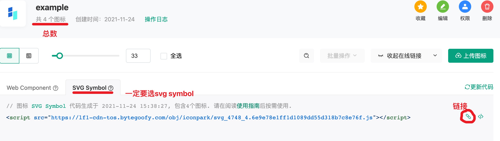

# IconPark Mini Program Cli

---

icon-park 小程序组件构建

[](https://oclif.io)
[](https://npmjs.org/package/@iconpark-miniprogram/cli)
[](https://npmjs.org/package/@iconpark-miniprogram/cli)
[](https://github.com/yangger6/iconpark-miniprogram/blob/master/packages/cli/package.json)

## 特性

* 自动检测分析项目根目录的 `iconpark-miniprogram.json`
* 支持构建微信小程序的组件

## 使用方法
<!-- usage -->
```sh-session
$ npm install -g @iconpark-miniprogram/cli
$ @iconpark-miniprogram/cli COMMAND
running command...
$ @iconpark-miniprogram/cli --help [COMMAND]
USAGE
  $ @iconpark-miniprogram/cli COMMAND
...

```

## 示例

> ⚠️ 如何获取iconpark的链接和数量 ⬇️



### 1. 在小程序项目根目录创建 `iconpark-miniprogram.json`

```json
  {
    "link": "https://lf1-cdn-tos.bytegoofy.com/obj/iconpark/svg_4748_4.6e9e78e1ff1d1089dd55d318b7c8e76f.js", // iconpark svg 文件
    "total": 4, // 图标总数
    "path": "./components/iconParks/", // 组件保存路径
    "runtime": "weapp" // 运行平台 weapp ｜ alipay
  }
```

### 2. 构建`微信小程序`或`支付宝小程序`组件.

使用配置文件`iconpark-miniprogram.json`构建组件

```shell
$ @iconpark-miniprogram/cli // Automatic `iconpark-miniprogram.json` parsing 
// or
$ @iconpark-miniprogram/cli -c ./iconpark-miniprogram.example.json
```

### 3. 或者使用命令构建

```shell
$ @iconpark-miniprogram/cli --link https://lf1-cdn-tos.bytegoofy.com/obj/iconpark/svg_4748_4.6e9e78e1ff1d1089dd55d318b7c8e76f.js --total 4 --path ./components/iconParks --runtime weapp
```
